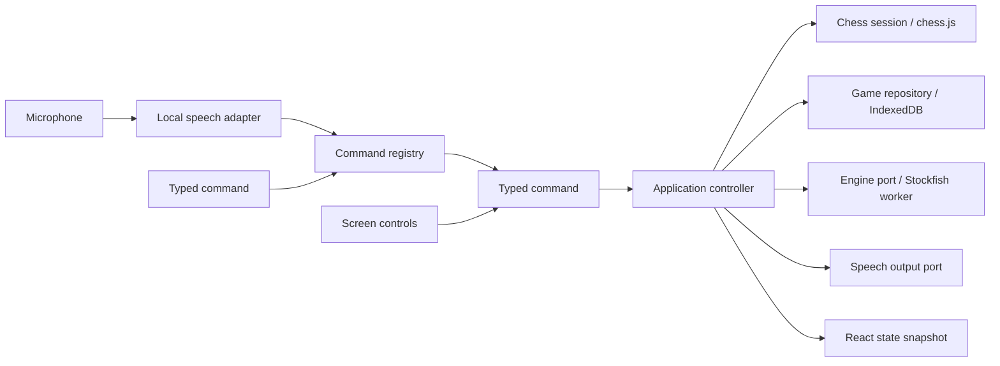

# Architecture and learning guide

## A move through the system

The board does not decide if a move is legal. The speech recognizer does not move a piece. Each component has one job and communicates through a small typed interface.

## Where to start reading

1. **`domain/types.ts`** defines the data. A `Command` is a discriminated union: its `type` determines which other fields exist. The compiler prevents a vision command with no square, for example. This is transferable to strongly typed languages such as C#, Java, and Rust.
2. **`domain/commands.ts`** converts words into that data. Full-utterance matching, contextual square normalization, and a required prefix keep recognition separate from execution. The same definitions generate help and settings.
3. **`domain/game.ts`** owns legal play. `chess.js` is the authoritative rules library. The application adds human-readable errors, announcements, PGN metadata, and review semantics. A small geometry helper only improves error explanations; it never authorizes moves.
4. **`ports/index.ts`** defines interfaces. This is dependency inversion: the application depends on what an engine or repository does, not a specific browser implementation.
5. **`application/controller.ts`** coordinates a use case: validate permission, apply a command, save it, announce feedback, and request an opponent move. React subscribes to stable immutable snapshots with `useSyncExternalStore`.
6. **`adapters/`** implements the outside world. IndexedDB stores games; a dedicated Worker runs Stockfish; another runs Vosk; AudioWorklet captures the microphone away from UI rendering.
7. **`ui/`** renders state and sends commands. Both voice and buttons obey the command settings. Review navigation does not alter live game history.

## Asynchronous work and races

An engine move is a promise, so it may finish after a user opens a different game. The controller increments an `epoch` on game changes. A result can update the board only if it belongs to the current epoch. The engine adapter also terminates old workers on cancellation. This pattern is useful for network requests, search boxes, and background processing in any application.

Every saved record includes a monotonically increasing revision. IndexedDB writes run in transactions and reject stale revisions. Saved moves are replayed through the rules library when a session is restored, preserving repetition history rather than trusting a FEN alone.

Deletion cancels the active engine epoch and atomically deletes the game while writing a small tombstone in IndexedDB version 2. A delayed save from this or another tab cannot recreate that ID. Failed deletion keeps the game visible and retryable. Settings merge with defaults so existing installations gain new commands without losing their previous choices.

## Speech adapters and diagnostics

`LocalSpeechInput` owns microphone capture, lifecycle cancellation, echo suppression, and a bounded observable diagnostics store. Vosk can run with or without its restricted vocabulary. `whisper.worker.ts` runs the alternative model; `voice-utils.ts` contains endpointing, rejection explanations, and synthesis pronunciation. All accepted final transcripts still go through the same command parser and controller. Recognition never supplies legal moves directly. `executeText` returns the decision for the diagnostic log.

The English Whisper pack has its own versioned cache and readiness marker, checked against every required file. Both model packs are assembled from SHA-256-verified parts. Runtime/model paths are self-hosted, remote model fallback is disabled, and ONNX uses one WASM thread for browser compatibility without SharedArrayBuffer. The 21 MB runtime is part of the optional pack, excluded from automatic app precaching. The UI keeps recognizer choice, debug visibility, and Vosk confidence in local settings.

## Offline design

There are three different stores:

- A Workbox-generated service worker precaches the versioned application and local engine. Updates wait for explicit activation.
- Cache Storage holds the complete speech archive after a verified download. The archive is downloaded in hosting-friendly parts and checked with SHA-256 before it becomes available. A service-worker route serves it to Vosk using a stable URL.
- IndexedDB stores games/settings and Vosk's internal model data. No password or simulated account is stored.

Development middleware serves the prepared model directly. Production uses the cached model route. Offline testing must use the production preview because development asset URLs change constantly.

## Adding a voice command

1. Add a case to the `Command` union and a `CommandId` in `domain/types.ts`.
2. Add its matching rule, description, and example to `COMMANDS`.
3. Add any new spoken words to `speechVocabulary()`.
4. Add the controller handler, default enabled setting, and a UI action if needed.
5. Test parsing (including rejection of unrelated speech) and the actual behavior.

No other command parser, help list, or speech-to-chess wiring needs to be rewritten. A future hint provider can reuse the engine port while remaining independently disableable.

## Adding online games

Online is a planned second implementation, not a second game UI. `OnlineGameTransport` already describes revision-checked move submission and subscriptions. A real backend must authenticate players, authorize access, verify the side to move and legal move, then append the move atomically. Never trust a browser-submitted FEN or result.

The local game repository can be wrapped with a sync repository/outbox. Local self/engine games remain playable offline. Friend games must clearly pause when disconnected; do not let both devices invent an offline continuation and overwrite each other later. Local unsynced practice records can upload with stable IDs, ownership, and revision checks after login.

The current `ownerId: null` means device-local practice. Assigning an account owner requires an explicit import/sync step. Public game visibility is separate from who may edit the game. Passwords still need a mature authentication system and proper hashing even if the game data is public.

## Native packaging later

The React UI, chess domain, command definitions, and application layer can be reused. A Capacitor mobile shell can replace speech/storage integrations when browser restrictions become limiting. Windows can use the installed PWA initially; a desktop shell is an additional packaging choice. Native packaging still needs platform testing, signing, and store/distribution work.

TypeScript is not a substitute for learning software engineering; it is a language in which to learn it. This project uses types, interfaces, dependency inversion, state machines, asynchronous concurrency, persistence, protocols, and automated tests—the same concepts used across backend and native software.
