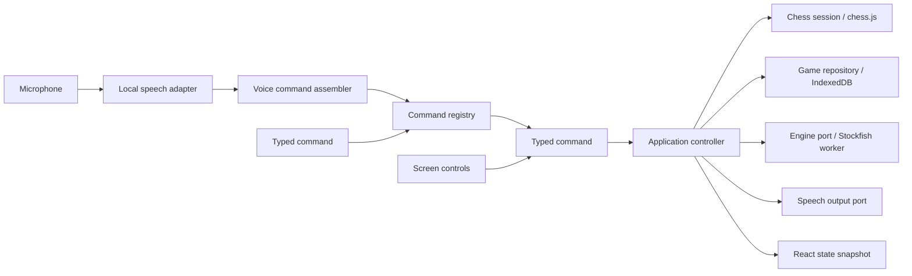

# Architecture and learning guide

## A move through the system

The board does not decide if a move is legal. The speech recognizer does not move a piece. Each component has one job and communicates through a small typed interface.

## Where to start reading

1. **`domain/types.ts`** defines the data. A `Command` is a discriminated union: its `type` determines which other fields exist. The compiler prevents a vision command with no square, for example. This is transferable to strongly typed languages such as C#, Java, and Rust.
2. **`domain/commands.ts`** converts complete command text into that data and registers its spoken slot patterns. **`domain/voice-grammar.ts`** defines reusable slots and contextual aliases; **`domain/voice-command.ts`** assembles finalized speech segments into a canonical command. Typed input goes straight to the strict parser. The same registry generates help and settings.
3. **`domain/game.ts`** owns legal play. `chess.js` is the authoritative rules library. The application adds human-readable errors, announcements, PGN metadata, and review semantics. A small geometry helper only improves error explanations; it never authorizes moves.
4. **`ports/index.ts`** defines interfaces. This is dependency inversion: the application depends on what an engine or repository does, not a specific browser implementation.
5. **`application/controller.ts`** coordinates a use case: validate permission, apply a command, save it, announce feedback, and request an opponent move. React subscribes to stable immutable snapshots with `useSyncExternalStore`.
6. **`adapters/`** implements the outside world. IndexedDB stores games; a dedicated Worker runs Stockfish; another runs Vosk; AudioWorklet captures the microphone away from UI rendering.
7. **`ui/`** renders state and sends commands. Both voice and buttons obey the command settings. Review navigation does not alter live game history.

## Asynchronous work and races

An engine move is a promise, so it may finish after a user opens a different game. The controller increments an `epoch` on game changes. A result can update the board only if it belongs to the current epoch. The engine adapter also terminates old workers on cancellation. This pattern is useful for network requests, search boxes, and background processing in any application.

Every saved record includes a monotonically increasing revision. IndexedDB writes run in transactions and reject stale revisions. Saved moves are replayed through the rules library when a session is restored, preserving repetition history rather than trusting a FEN alone.

Deletion cancels the active engine epoch and atomically deletes the game while writing a small tombstone in IndexedDB version 2. A delayed save from this or another tab cannot recreate that ID. Failed deletion keeps the game visible and retryable. Settings merge with defaults so existing installations gain new commands without losing their previous choices.

## Speech adapters and diagnostics

`LocalSpeechInput` owns microphone capture, lifecycle cancellation, echo suppression, and a bounded observable diagnostics store. Vosk can run with or without its restricted vocabulary. `whisper.worker.ts` runs the alternative model; `voice-utils.ts` contains endpointing and synthesis pronunciation. All three modes feed stable final transcripts to `VoiceCommandAssembler`; partial hypotheses only update diagnostics. A live settings getter applies confidence changes without restarting the microphone.

The assembler finds the last actual wake word in a segment, then advances candidate patterns one slot at a time. Wrong-slot words, unknown tokens, and low-confidence words are skipped without discarding later words. Accepted slots persist across finalized segments with no timeout. Repeating the wake word resets the chain. A complete pattern produces canonical text for the existing parser and controller; it never guesses legal moves. Optional arguments extend patterns within the same segment; an already complete shorter form executes at the segment boundary. `executeText` returns the controller's decision for the log. Vosk's acoustic vocabulary is fixed for the selected mode; slot filtering constrains accepted transcripts, not decoder scores.

Position/review changes, microphone stops, recognition setting changes, and explicit cancellation clear pending input. Resetting creates a fresh Vosk recognizer and ignores callbacks from the removed one; Whisper job epochs prevent a result captured before cancellation from executing afterward. Announcements suppress capture and clear unfinished speech to prevent echo from completing it. The pending prefix and expected slot are visible independently of debug mode.

Speech output accepts `SpeechPreferences` through its port. The controller configures the adapter when loading or updating settings. `domain/speech-preferences.ts` supplies missing defaults and maps the retired phonetic mode to flowing letters while preserving saved gaps and voice selection. `voice-utils.ts` creates a speech plan: each segment has text and a `pauseBeforeMs`. The default emits one utterance with capital letters and rank words, with no commas inserted inside squares. Adjustable mode uses independent extra gaps before a file letter (0–600 ms) and before its rank (0–300 ms). Zero-gap boundaries are coalesced into one utterance so they do not introduce a synthesis restart; a sentence starting with a square has no artificial leading pause. Original sentence punctuation is preserved.

Positive timers add to any silence the OS voice inserts; they cannot set the total audible pause. A sequence counter, active-utterance identity, and cancelled timers prevent stale or duplicate callbacks from queuing extra syllables. Echo protection remains active throughout either deliberate gap. Changes to either gap cancel unfinished narration before the next preview.

`BrowserSpeechOutput.say` appends a complete announcement to a FIFO queue without cancelling the current one or blocking the caller. The next line begins only after the current line's last segment ends. This lets Stockfish finish and update the board while its narration waits behind the move confirmation. `speaking` remains true across the whole queue for echo suppression. `stop` clears pending lines and timers, cancels native synthesis, and invalidates callbacks; mute, pronunciation changes, game changes, review navigation, and starting a new pronunciation preview use that cancellation path. Both native error callbacks and synchronous synthesis failures clear the queue so it cannot remain stuck active. Both manual gap defaults are zero; stored user choices remain intact.

`ui/SpeechSettings.tsx` supplies the mode, gap, installed-English-voice selector, and preview controls. The voice list follows `voiceschanged`; saved voice URIs are resolved anew for each announcement and fall back if unavailable. Preview uses the same output adapter as narration, without changing the game or feedback history. Native adapters can implement the same preference contract.

The English Whisper pack has its own versioned cache and readiness marker, checked against every required file. Both model packs are assembled from SHA-256-verified parts. Runtime/model paths are self-hosted, remote model fallback is disabled, and ONNX uses one WASM thread for browser compatibility without SharedArrayBuffer. The 21 MB runtime is part of the optional pack, excluded from automatic app precaching. The UI keeps recognizer choice, debug visibility, and Vosk confidence in local settings.

## Offline design

There are three different stores:

- A Workbox-generated service worker precaches the versioned application and local engine. Updates wait for explicit activation.
- Cache Storage holds the complete speech archive after a verified download. The archive is downloaded in hosting-friendly parts and checked with SHA-256 before it becomes available. A service-worker route serves it to Vosk using a stable URL.
- IndexedDB stores account games/outboxes, device settings, and Vosk's internal model data. Firebase Auth manages persisted login credentials; application code does not store passwords. Guest history uses sessionStorage.

Development middleware serves the prepared model directly. Production uses the cached model route. Offline testing must use the production preview because development asset URLs change constantly.

## Adding a voice command

1. Add a case to the `Command` union and a `CommandId` in `domain/types.ts`.
2. Add its strict matching rule, spoken `voice` slot patterns, description, and example to `COMMANDS`. Reuse slots from `voice-grammar.ts` where possible.
3. Add any new spoken words to `speechVocabulary()`.
4. Add the controller handler, default enabled setting, and a UI action if needed.
5. Test strict parsing, voice assembly across pauses and unrelated words, and the actual behavior. Registry examples are also checked through the assembler.

No other command parser, help list, or speech-to-chess wiring needs to be rewritten. A future hint provider can reuse the engine port while remaining independently disableable.

## Accounts and history sync

`application/accounts.ts` uses Firebase Authentication for email/password login/recovery and atomically reserves a username with its public profile. Emails stay in Authentication. `main.tsx` creates a new workspace on UID changes, stops old engine/voice work, and binds its repository permanently to that identity. A late save cannot switch owners.

`GuestRepository` keeps tab-scoped history, never imported on login. Device settings still use `apex-chess`; account games/outboxes use `apex-accounts-v1`, keyed by `[ownerId, id]`. `SyncedRepository` commits locally first and uploads asynchronously through the `CloudHistory` port. `FirebaseHistory` listens to a per-owner query and performs version-checked transactional writes.

Cloud `version` is independent of chess revision: deletion is a versioned null-game tombstone, which rules prohibit resurrecting or physically deleting. Each pending entry has a `changeId`; an upload acknowledgment cannot clear a newer move made during upload. Compatible histories advance to newer versions; divergent branches get separate IDs. Remote deletion wins over stale offline continuation. Local merges are transactional. Firebase's own disk write cache is disabled to avoid a competing last-write-wins outbox.

The controller refreshes its board/history from the local cache and invalidates engine searches for changed positions. `SyncNotice` distinguishes local saves from confirmed uploads. Pending changes survive logout and upload on that account's next login. Offline play needs cached assets and a previously signed-in identity, not a new offline login. Public browsing/profile screens are intentionally deferred; current rules already separate ownership from visibility.

## Adding friend games

Online is a planned second implementation, not a second game UI. `OnlineGameTransport` already describes revision-checked move submission and subscriptions. A real backend must authenticate players, authorize access, verify the side to move and legal move, then append the move atomically. Never trust a browser-submitted FEN or result.

The practice-history outbox is now implemented. Friend games must use a separate server-authoritative collection/API and pause when disconnected. Public practice-history writes are not a multiplayer security boundary. Do not allow both players to invent offline continuations and overwrite each other later.

`ownerId: null` means guest practice. Signed-in games receive their owner at creation; existing guest games never acquire an owner. Future friends/profiles can use the existing immutable `profiles/{uid}` and `usernames/{name}` records.

## Native packaging later

The React UI, chess domain, command definitions, and application layer can be reused. A Capacitor mobile shell can replace speech/storage integrations when browser restrictions become limiting. Windows can use the installed PWA initially; a desktop shell is an additional packaging choice. Native packaging still needs platform testing, signing, and store/distribution work.

TypeScript is not a substitute for learning software engineering; it is a language in which to learn it. This project uses types, interfaces, dependency inversion, state machines, asynchronous concurrency, persistence, protocols, and automated tests—the same concepts used across backend and native software.
